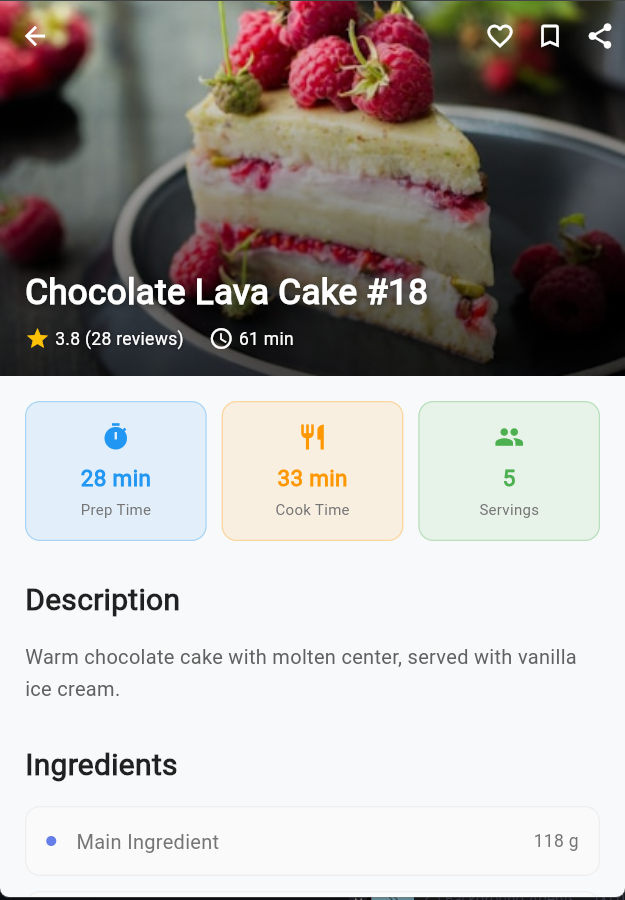
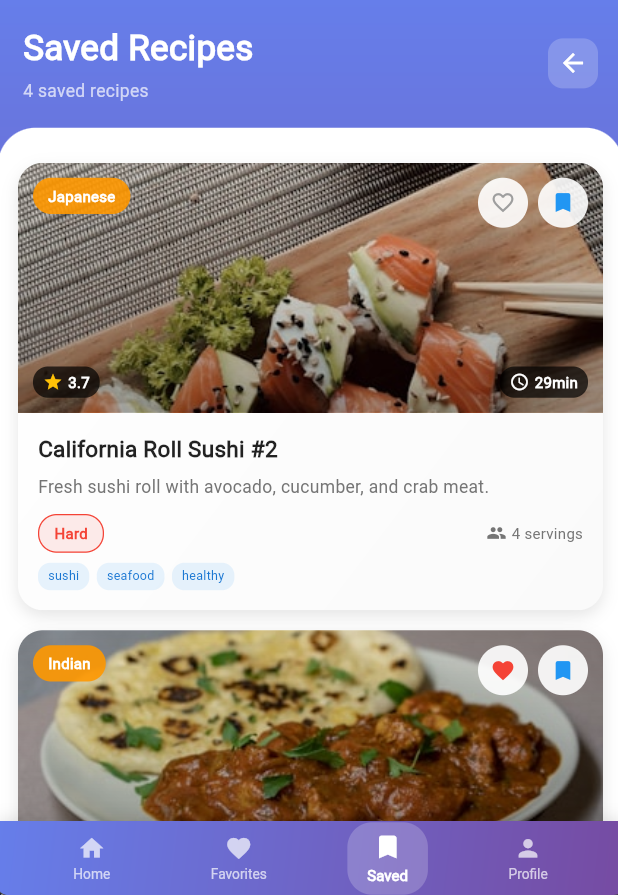
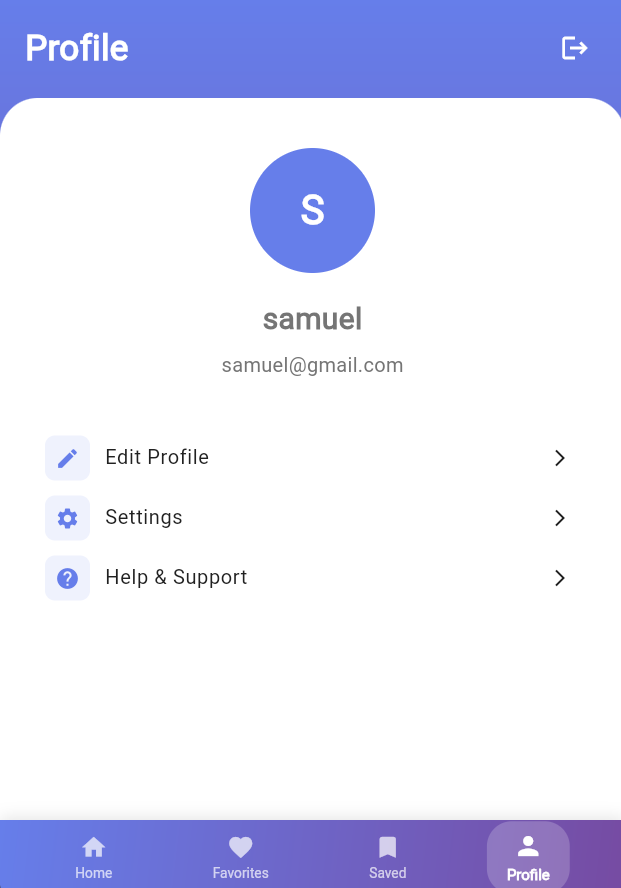

# 🍽️ Flutter Recipe App

A simple and beautiful Flutter recipe application.

## 🚀 Getting Started

This project is a starting point for a Flutter application.

A few resources to get you started if this is your first Flutter project:

- [Lab: Write your first Flutter app](https://docs.flutter.dev/get-started/codelab)
- [Cookbook: Useful Flutter samples](https://docs.flutter.dev/cookbook)

For help getting started with Flutter development, view the
[online documentation](https://docs.flutter.dev/), which offers tutorials,
samples, guidance on mobile development, and a full API reference.

---

## 🖼️ Screenshots

### 🔹 Home Screen

### 🔹 Authentication Pages

### 🔹 Recipe Detail Page

### 🔹 Favorites Page

### 🔹 Saved Page

### 🔹 Builder Page

### 🔹 Profile Page

---

## 📦 Features

- Browse recipes by category
- View detailed cooking instructions
- Mark recipes as favorites
- Responsive UI with beautiful design
